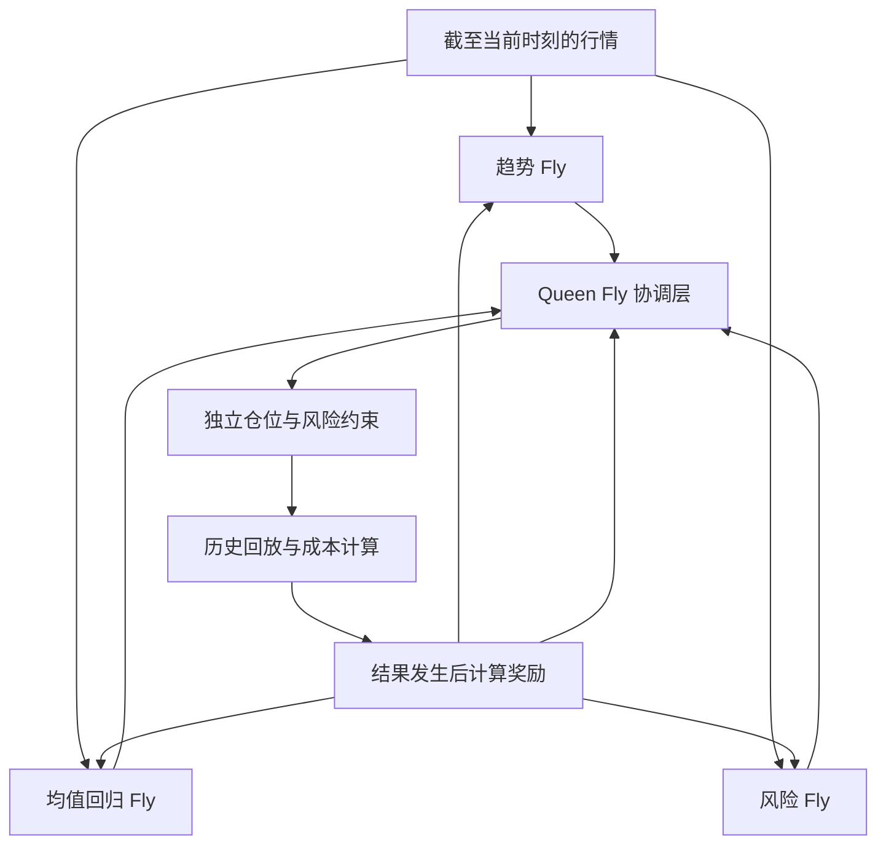

# 三个策略模块与协调模块

本设计把“飞”和“蜂王”当作计算模块名称，不把它们解释为真实的果蝇社会行为、共享意识或一只完整果蝇的缩小复制。三模块加协调层是当前候选起点，不是固定答案；模块数量应以边际效果、相关输出和额外计算成本决定。当前优先目标是可审计的离线研究，不是直接构建交易系统。

多 Fly 扩展还需要独立的双向消息适配器和任务协调层，详见[AGENT_PROTOCOL.md](AGENT_PROTOCOL.md)。这允许人类、Fly、coordinator、executor 和 advisor 交换有界证据与请求，但不把语言能力、意识或工具权限归因于连接组数值核心。

## 设计依据与边界

- Vasan 等人在 2024 年 Nature 研究中展示了果蝇蘑菇体短期和长期记忆单元、PPL1/PAM 多巴胺信号、MBON 反馈，以及一个受连接组和脉冲数据约束的动力学模型。这支持把固定连接拓扑、递归状态和奖励调制作为可检验的计算启发，不支持把财务奖励等同于生物奖励。
- 2024 年 Nature 的全脑连接组统计显示，不同神经区的递归性、连接强度和多巴胺连接比例不同。它支持记录拓扑特征并做区域或子图消融，不支持任意把 segment 直接命名为策略神经元。
- 2020 年 Nature Neuroscience 的果蝇学习中心研究支持 DAN 上游回路中的递归和层次结构。项目先使用固定递归动力学和紧凑 readout，奖励塑性只采用明确的工程规则。
- 2025 年 Nature Communications 的集体决策综述强调局部互动和反馈可以形成集体选择。项目将其转化为低维、时间对齐的模块间消息，并把直接跨网络神经元连接留作探索性对照。

来源链接：

- [Nature 2024：Dopamine-mediated interactions](https://www.nature.com/articles/s41586-024-07819-w)
- [Nature 2024：Network statistics of the whole-brain connectome](https://www.nature.com/articles/s41586-024-07968-y)
- [Nature Neuroscience 2020：Recurrent architecture for adaptive regulation](https://www.nature.com/articles/s41593-020-0607-9)
- [Nature Communications 2025：Collective intelligence in animals and robots](https://www.nature.com/articles/s41467-025-65814-9)

## 当前候选架构

### 设计总图

下图保存当前讨论的候选结构。三种 specialist、Queen、独立风险约束和延迟奖励回路中，当前代码已经实现的是单 connectome 路径、市场输入、经典/量子 readout 和有限 paper backtest；三 specialist、Queen 的独立学习和奖励回路正在作为下一阶段逐步验证。更少模块或简单均值如果在匹配预算下更稳健，应保留简单方案。

奖励箭头表示延迟反馈，默认只在训练段更新，不能把同一时刻的未来结果反馈给决策。外部风险 clamp 独立于 Queen，不能由 Queen 自行放宽。

1. 起始比较使用一个模块、三个独立模块和可选协调模块，共享同一份不可变的实际连接图。每个 specialist 使用不同且时间因果的特征视图：趋势、均值回归或波动率风险。角色是工程设定，需用消融证明差异不是随机噪声。
2. 每个模块通过固定稀疏递归动力学产生低维输出，并用小型 readout 映射为候选信号。初期不训练全部突触权重，避免把解剖接触计数直接当作已验证的动力学。
3. 每个模块向协调器发送有限 typed message，例如方向、置信度、风险、状态新颖度和时间戳。消息不能携带任意大状态，避免隐式共享全部网络。
4. 第四个协调模块拥有独立状态和 readout，先与简单经典均值、加权均值和风险约束聚合器比较。它可以称为 coordinator，不预先称为真实的 queen fly。
5. 确定性的风险约束位于协调器之后，独立限制杠杆、集中度、换手和缺失输入。它不是神经模块，也不交给协调器自行放宽。
6. 奖励只在因果的执行后窗口计算，扣除成本和滑点。每个模块得到按其消息贡献分配的工程 credit signal，塑性规则单独记录，不能称为生物学复制。

PennyLane 只作为小规模评分或聚合实验。先比较 4-qubit analytic expectation 与经典协调器的质量、时间和资源；不假设量子加速。三个模块输出到四个量子输入的映射必须明确，第四输入不可任意补齐。

## 阶段与停止条件

- A：单模块真实官方子图加市场输入，验证 schema、ID、因果特征、状态更新、readout 和资源 receipt。
- B：三模块独立状态，做 1 个模块、3 个模块、3 个加协调器的匹配预算对照。
- C：加入因果奖励、成本和 walk-forward，比较固定 readout 与有限工程塑性。
- D：比较经典协调器、fly-inspired 协调器、可选量子聚合器，并做拓扑子集、随机拓扑和度数匹配对照。

保留 promotion 条件：输出必须对输入敏感且非 NaN，重复种子结果可复现，时间切分无泄漏，成本后质量在多个窗口不只依赖单个种子，资源和失败率有记录。若多模块只增加相关错误、计算成本、换手或不稳定性，则停止升级。当前 4,096 个注释 segment 是实际运行子集，不能称作全脑；是否扩大到完整注释图必须由扫描、内存、边数和运行时间实测决定。
